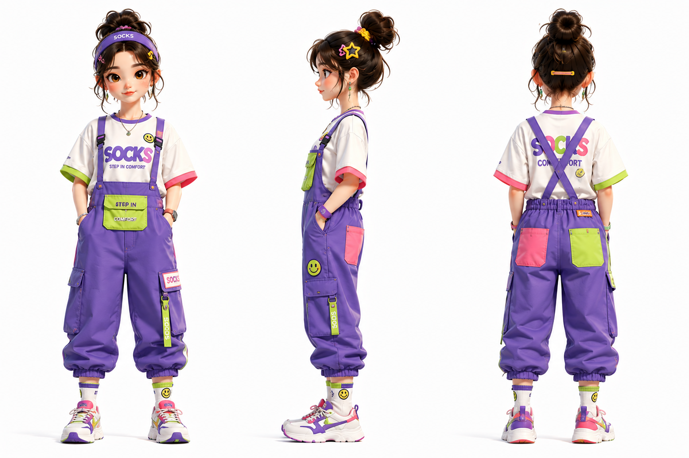
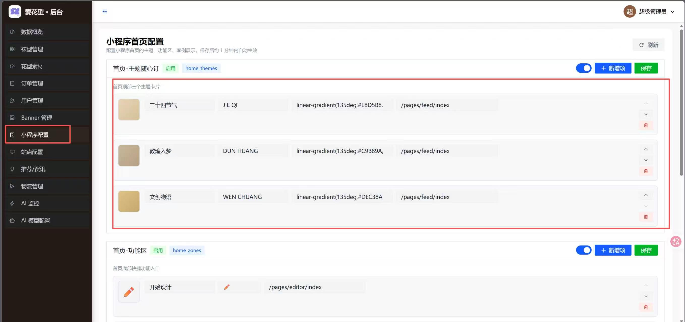
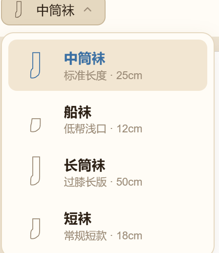
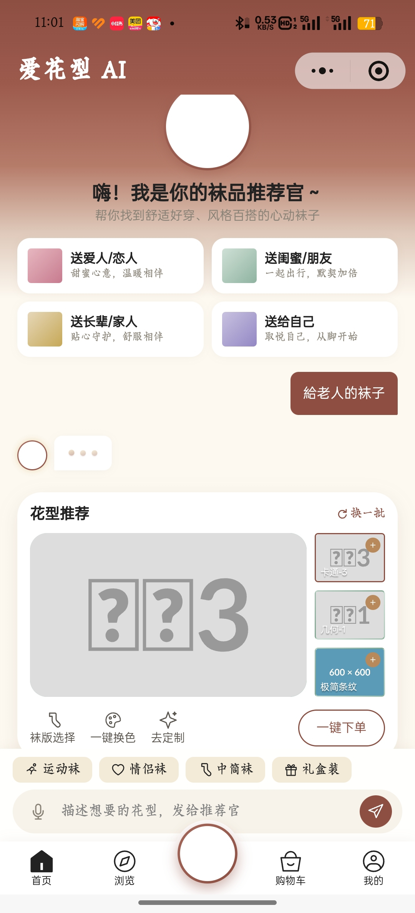
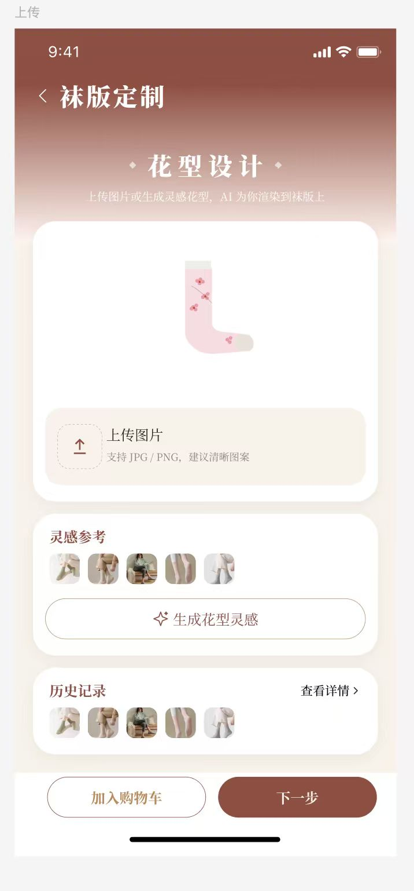
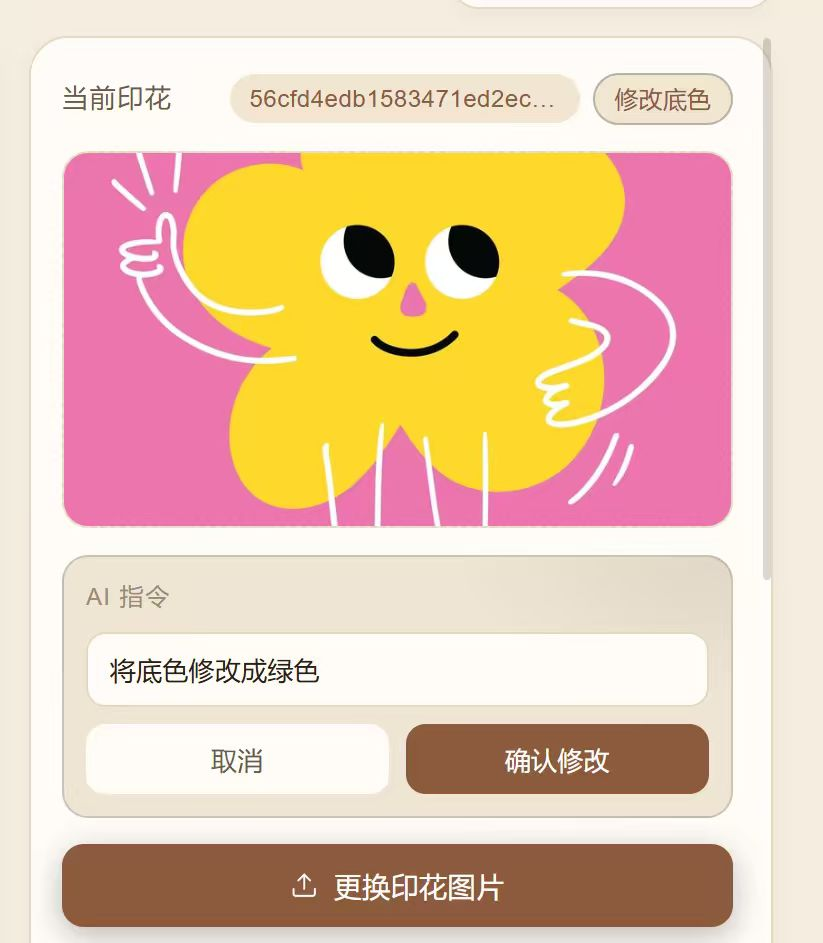
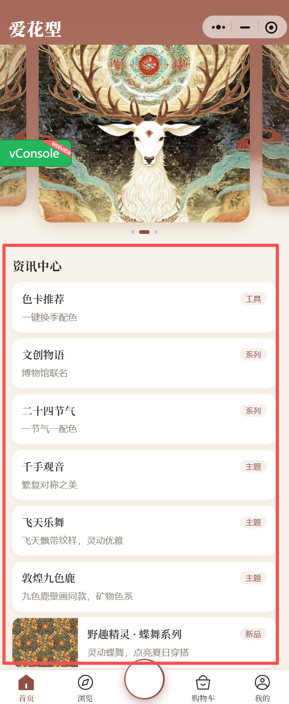

# 待处理需求清单（飞书表格导出）

> 来源：飞书多维表格 BUG/需求表 · 导出 2026-06-15 14:57
> 筛选条件：BUG状态1 = 待处理

共 6 项待处理。

---

## 1. 小程序的AI形象置入

- 模块：AI助手
- 状态：待处理 / 待处理

---

## 2. 后台的小程序首页配置在哪填图片

- 模块：后台
- 状态：待处理 / 待处理

---

## 3. AI助手下面点击袜版选择，需要适配一个选择袜版的界面

- 模块：AI助手
- 状态：待处理 / 待处理

---

## 4. AI助手下面点击去定制，应该跳转到定制设计页面

- 模块：AI助手
- 状态：待处理 / 待处理

---

## 5. AI助手下面一键换色，应该跳转到一个AI对话框

- 模块：AI助手
- 状态：待处理 / 待处理

---

## 6. 首页的咨询中心不需要，可以去掉

- 模块：首页
- 状态：待处理 / 待处理

---
