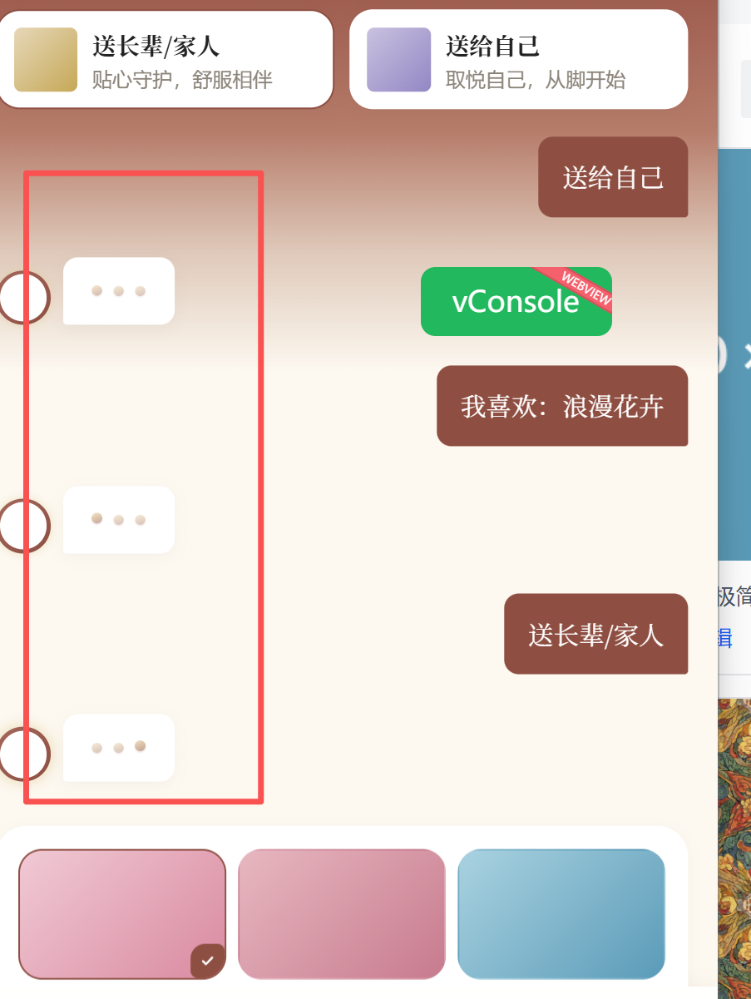

# 待处理需求清单（飞书表格导出）

> 来源：飞书多维表格 BUG/需求表 · 导出 2026-06-15 16:06
> 筛选条件：BUG状态1 = 待处理

共 3 项待处理。

---

## 1. AI助手下面大框应该是袜版选择 

- 模块：AI助手

---

## 2. 预览页面按照之前的原型来

- 模块：预览

---

## 3. AI助手的对话一直在加载

- 模块：AI助手

---
