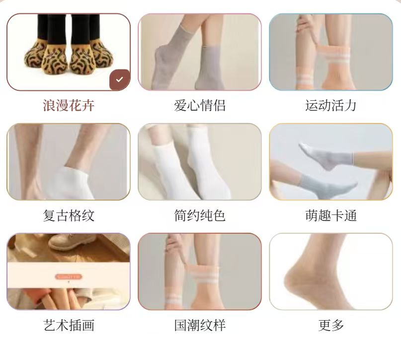
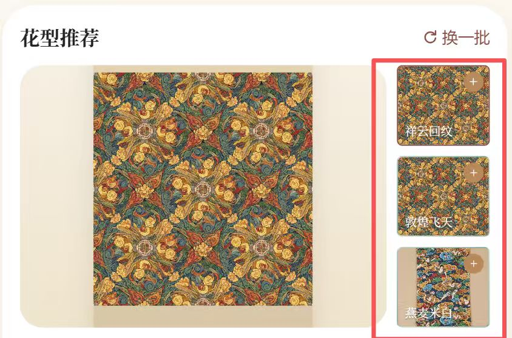
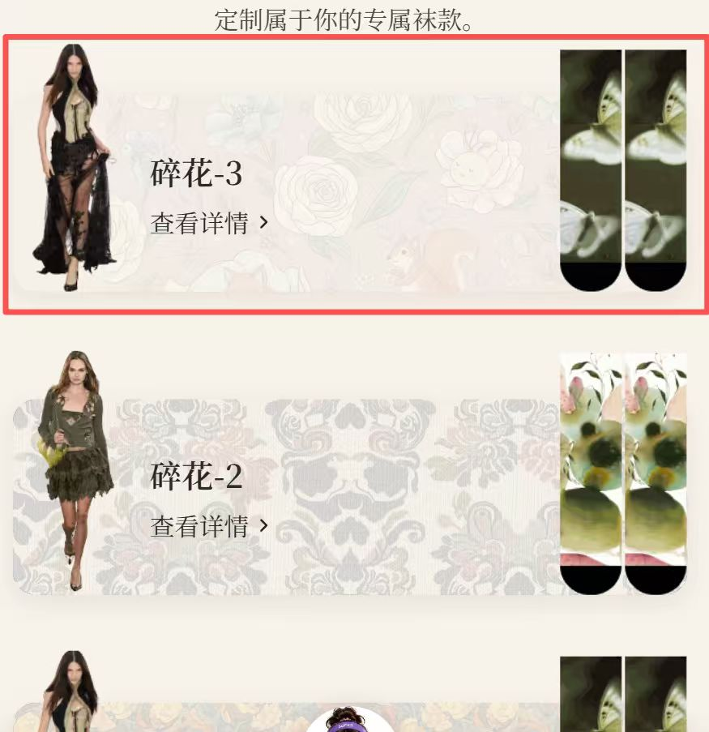
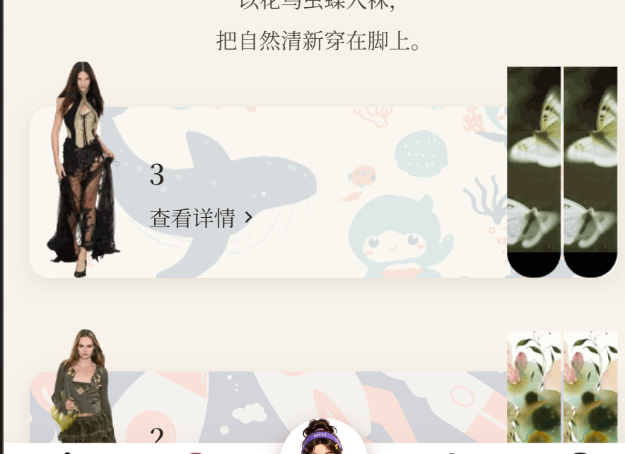
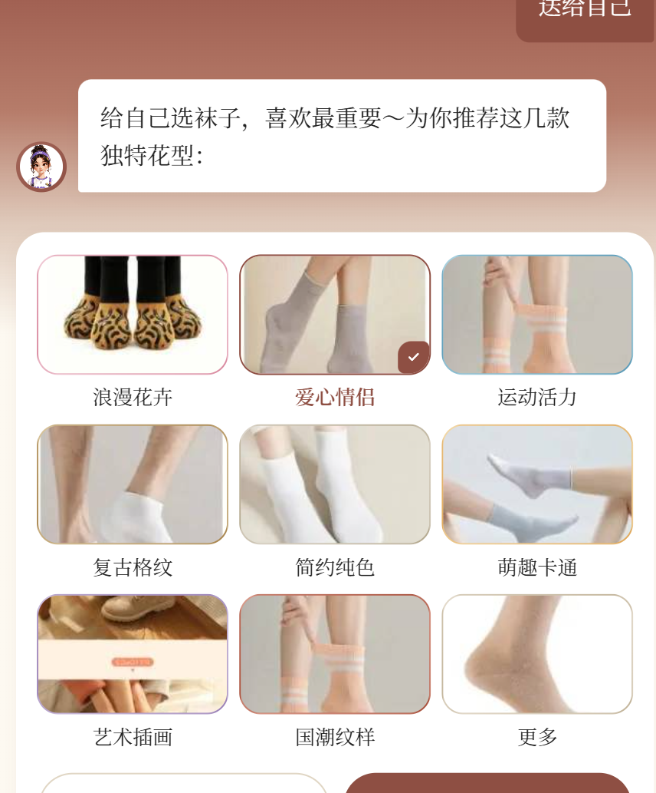
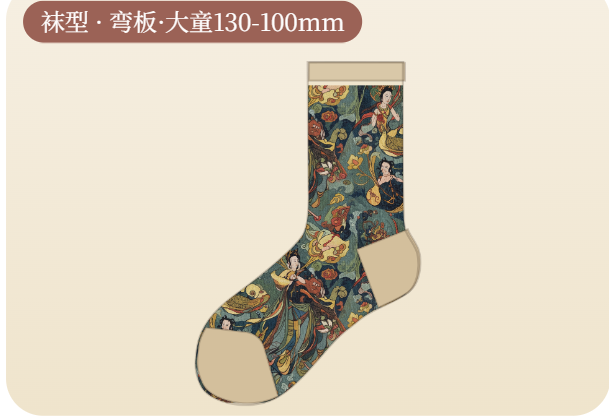
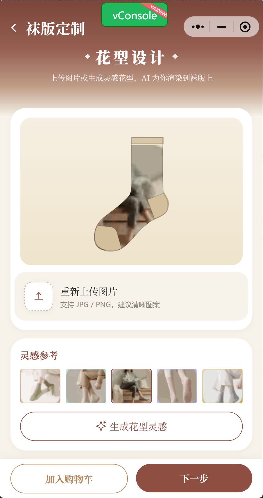
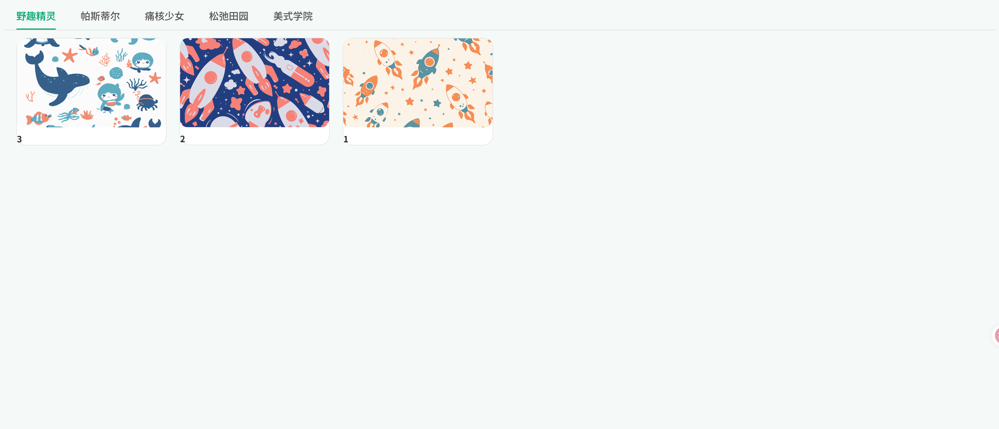
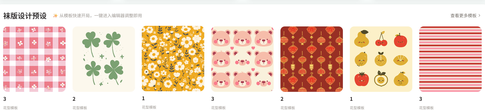
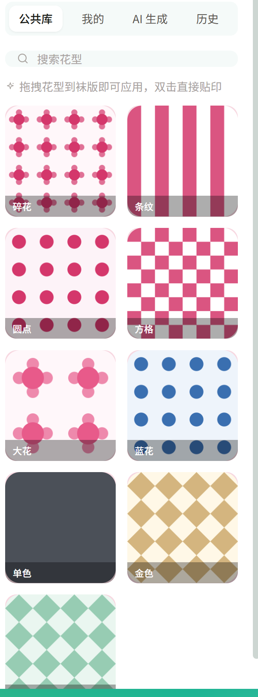

# 待处理需求清单（飞书表格导出）

> 来源：飞书多维表格《袜子小程序web的问题维护》
> 链接：https://my.feishu.cn/wiki/IOX4wOPWpiM0e7klQcscw7f9njd?table=tblt71WCcW4LUngs&view=vewWHFaE6p
> 筛选条件：BUG状态 = 待处理

共 12 项待处理。

---

## 1. 要按照卡片内容相对应地配置好图片

- 状态：待处理
- 模块：图片配置
- 表格行号：第 20 行（记录ID recvmLp2DS3mGO）

---

## 2. 发现页的图片没有地方配置，里面的商品详情也没有地方配置

- 状态：待处理
- 模块：图片配置
- 表格行号：第 25 行（记录ID recvmYDpp64RW9）

---

## 3. 点击上面的主题，应该是下面的三个主题图切换，而不是跳转到浏页面。然后下面的主题图点击是需要跳转到商品详情页，而且需要对主题页跳转的商品详情进行可配置

- 状态：待处理
- 模块：首页
- 表格行号：第 26 行（记录ID recvmYDHR6hcdE）

---

## 4. 浏览页的标题没有配置的地方

- 状态：待处理
- 模块：预览
- 表格行号：第 27 行（记录ID recvmYDUlDwcTB）

---

## 5. 推荐花型的封面图以及选择不同人群时，跳出的花型类别都需要可以配置

- 状态：待处理
- 模块：AI助手
- 表格行号：第 28 行（记录ID recvmYEDlAoGhB）

---

## 6. 袜版渲染有问题（袜头、袜跟、螺口有缝隙），且袜头袜跟的初始颜色应该是白色

- 状态：待处理
- 模块：AI助手
- 表格行号：第 29 行（记录ID recvmYFOyo2mSO）

---

## 7. 去定制界面的灵感参考图需要可配置

- 状态：待处理
- 模块：AI助手
- 表格行号：第 30 行（记录ID recvmYGaDBDQfq）

---

## 8. web端的推荐页面在哪配置？然后点击之后应该和小程序一样，跳转到商品详情页

- 状态：待处理
- 模块：web端
- 表格行号：第 31 行（记录ID recvmYGUeaH1Sl）

---

## 9. web端袜版的渲染以及袜头袜跟螺口部分的初始颜色存在问题

- 状态：待处理
- 模块：web端
- 表格行号：第 32 行（记录ID recvmYHhgIO2Qa）

---

## 10. 首页渐变动效那里初始应该是袜版的形状

- 状态：待处理
- 模块：首页
- 表格行号：第 33 行（记录ID recvmYIczahpgA）

---

## 11. web端的模板预设没有配置的地方

- 状态：待处理
- 模块：web端
- 表格行号：第 34 行（记录ID recvmYISU3kxH2）

---

## 12. 花型库同步小程序的

- 状态：待处理
- 模块：web端
- 表格行号：第 35 行（记录ID recvmYJ00pz1Gf）

---
