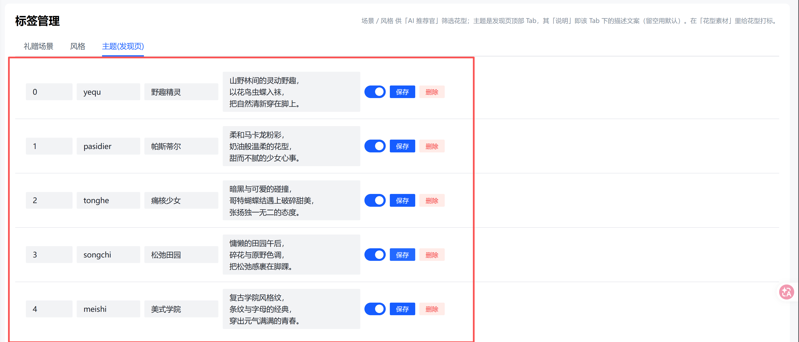
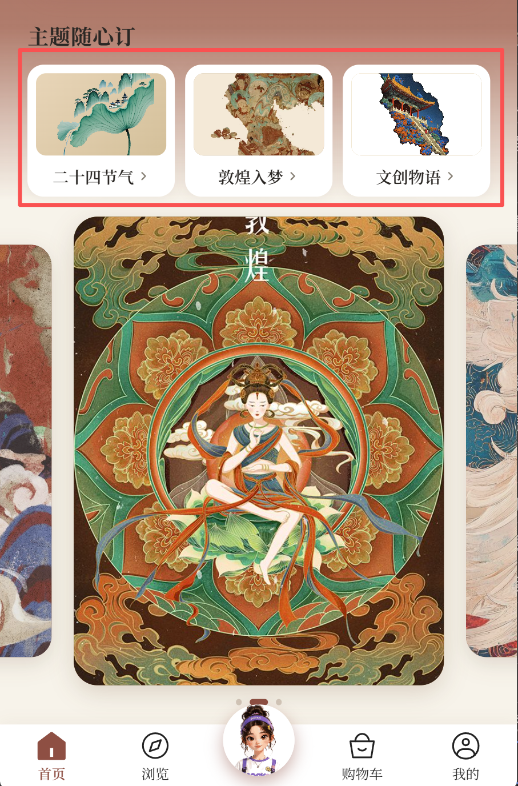
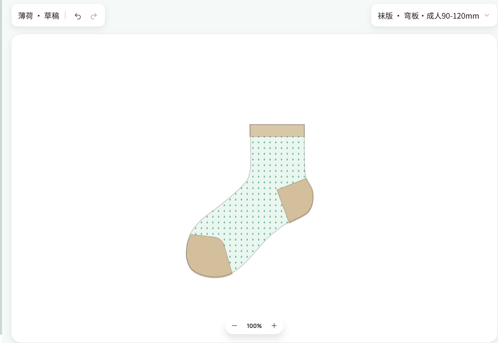
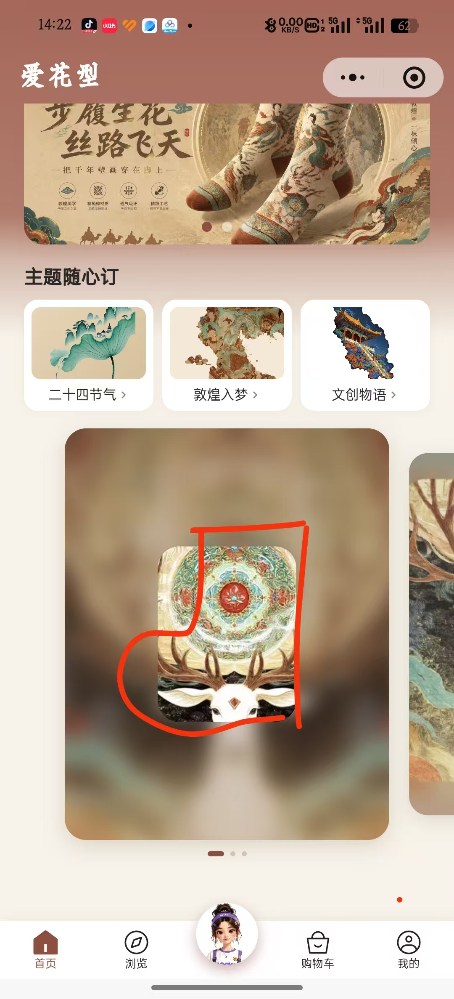
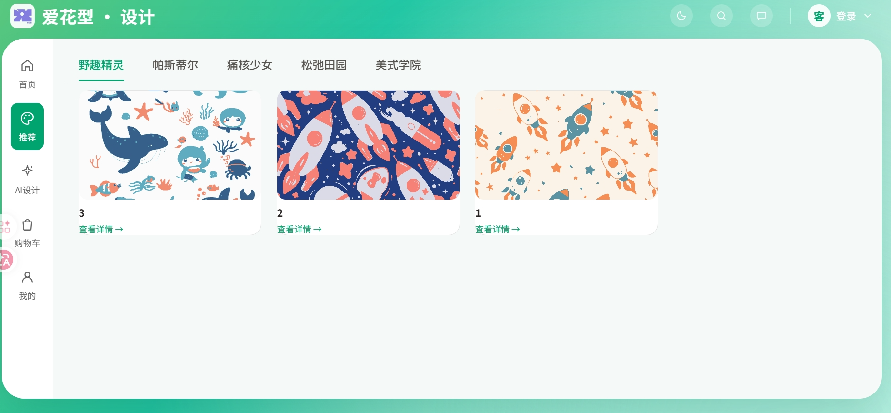

# 待处理需求清单（飞书表格导出）

> 导出日期：2026-06-20
> 来源：飞书多维表格《袜子小程序web的问题维护》
> 链接：https://my.feishu.cn/wiki/IOX4wOPWpiM0e7klQcscw7f9njd?table=tblt71WCcW4LUngs&view=vewWHFaE6p
> 筛选条件：BUG状态 或 BUG状态1 = 待处理

共 9 项待处理。

---

## 1. 发现页的图片没有地方配置，里面的商品详情也没有地方配置

- 状态：待处理 / 待处理
- 模块：图片配置
- 表格行号：第 25 行（记录ID recvmYDpp64RW9）
- 备注：【验收说明】发现页轮播图、商品详情配图可在后台「小程序配置」中维护；Feed/发现接口已对接配置项。

---

## 2. 首页的主题随心订，共有"二十四节气"，”敦煌入梦“,"文创物语"三个固定小卡片展示的三个主题，点击每个小卡片主题，下方的三张可滑动的卡片，应该切换成该主题的主题图。且点击该主题图，可跳转到商品详情页并允许配置

- 状态：待处理 / 待处理
- 模块：首页
- 表格行号：第 26 行（记录ID recvmYDHR6hcdE）
- 备注：【验收说明】首页顶部主题 Tab 点击切换下方三张主题图（不再跳转浏览页）；主题图点击跳转可配置的商品详情页。

---

## 3. 浏览页面标题、点进去以后的商品详情页、浏览页面展示的商品数量，都需要可配置

- 状态：待处理 / 待处理
- 模块：预览
- 表格行号：第 27 行（记录ID recvmYDUlDwcTB）
- 备注：【验收说明】浏览/Feed 页标题可在后台配置中修改，前端从 catalog 配置读取展示。

---

## 4. AI助手展示的袜版，渲染有问题（袜头、袜跟、螺口有缝隙），且袜头袜跟的初始颜色应该是白色

- 状态：待处理 / 待处理
- 模块：AI助手
- 表格行号：第 29 行（记录ID recvmYFOyo2mSO）
- 备注：【验收说明】sockVector 修复袜头/袜跟/螺口缝隙；袜头袜跟初始颜色改为白色；已构建小程序验证。

---

## 5. web端的推荐页面点击之后应该和小程序一样，跳转到商品详情页，商品详情页的版式要和小程序类似，然后做一下适配

- 状态：待处理 / 待处理
- 模块：web端
- 表格行号：第 31 行（记录ID recvmYGUeaH1Sl）
- 备注：【验收说明·后台配置】Web 推荐 Tab → 标签管理 → 主题(发现/Web推荐)，给花型打主题标签后 Web 推荐页按主题展示；卡片点击跳转商品详情（与小程序一致）。

---

## 6. web端袜版的渲染以及袜头袜跟螺口部分的初始颜色存在问题

- 状态：待处理 / 待处理
- 模块：web端
- 表格行号：第 32 行（记录ID recvmYHhgIO2Qa）
- 备注：【验收说明】Web 编辑器袜版矢量渲染与小程序对齐：袜头/袜跟/螺口初始白色，缝隙问题已修复（vectorSock 默认色）。

---

## 7. 首页三张滑动卡片的渐变动效初始应该是袜版的形状，由模糊到清晰

- 状态：待处理 / 待处理
- 模块：首页
- 表格行号：第 33 行（记录ID recvmYIczahpgA）
- 备注：【验收说明】首页渐变动效初始形态改为袜版轮廓形状（非通用图形）。

---

## 8. web端的模板预设没有配置的地方

- 状态：待处理 / 待处理
- 模块：web端
- 表格行号：第 34 行（记录ID recvmYISU3kxH2）
- 备注：【验收说明·后台配置】Web 模板预设 → 小程序/Web 首页配置 → home_cases：填写封面图 + 跳转链接（如 pattern:52 或 /product/52）。

---

## 9. web端的推荐页面应该有配置的地方

- 状态：待处理 / 待处理
- 模块：web端
- 表格行号：第 38 行（记录ID recvmZqR69mBQs）

---

