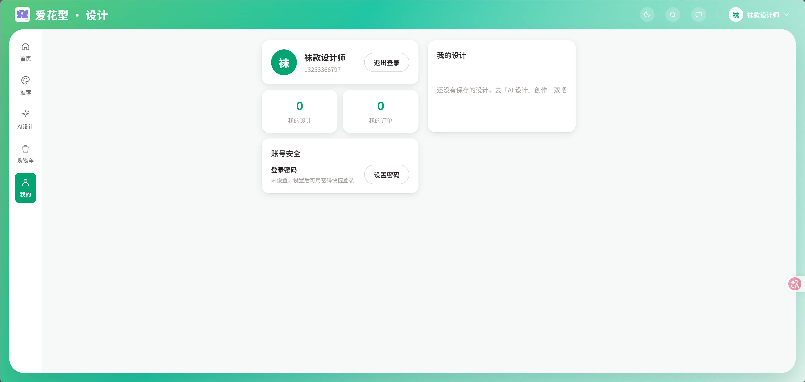
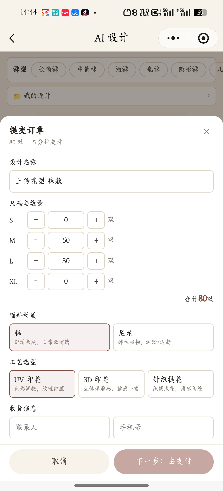
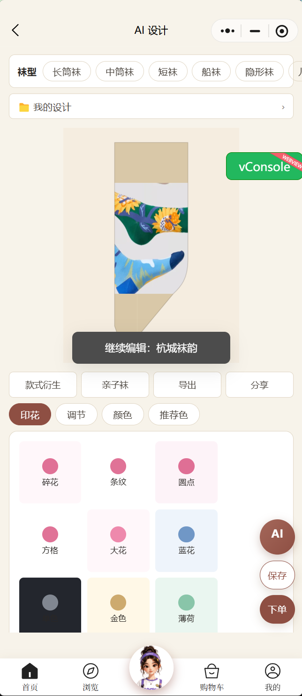
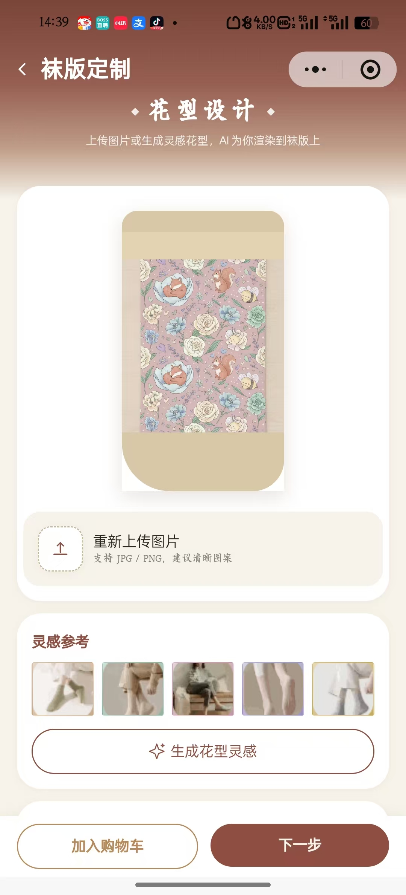

# 袜子小程序web问题维护 — 待处理清单

> 来源：飞书多维表格《袜子小程序web的问题维护》
> 链接：https://my.feishu.cn/wiki/IOX4wOPWpiM0e7klQcscw7f9njd?table=tblt71WCcW4LUngs&view=vewWHFaE6p
> 抓取条件：BUG状态 = 待处理，共 4 条记录、10 张配图。

---

## 1. 要按照卡片内容相对应地配置好图片

- 状态：待处理
- 模块：图片配置
- 表格行号：第 20 行（记录ID recvmLp2DS3mGO）

附件/截图：

---

## 2. 小程序和web端需要接上真实的支付功能实现支付(沿用爱花型)

- 状态：待处理
- 模块：支付
- 表格行号：第 21 行（记录ID recvmLrar0LXzV）

附件/截图：

.png)

.jpg)

---

## 3. "我的“页面这里看起来像app端，需要适配一下

- 状态：待处理
- 模块：web端
- 表格行号：第 22 行（记录ID recvmMmgbp2FuQ）

附件/截图：

---

## 4. 袜版定制的下一步直接下单，不需要再跳转AI设计

- 状态：待处理
- 模块：AI助手
- 表格行号：第 24 行（记录ID recvmMtN8h8FoB）

附件/截图：

---
